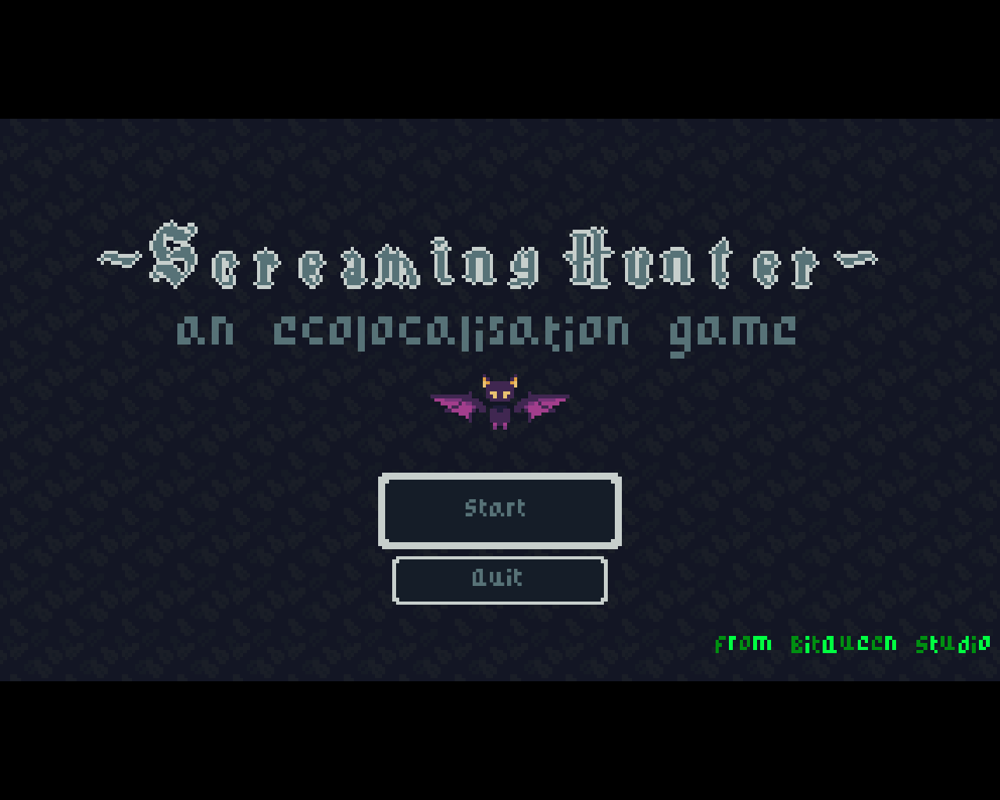
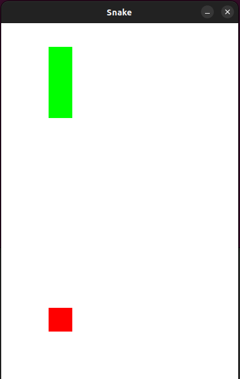

# Portfolio

Ici se trouve tous mes projets de programmation. Pour lancer les projets écrits en rust, il faut installer le gestionnaire de paquet de Rust (cargo) et lancer la commande suivante depuis le fichier du projet :
```
cargo run
```

# Principaux projets

## Rust-math

Ce projet avait pour but de m'entrainer à utiliser les generics en créant un programme capable de représenter les suites arithmetiques et géometriques et de calculer n'importe quelle valeur de la suite au range $n$.

J'ai essayé de créer un macro qui me permettrait de générer toutes les fonctions de tests mais ça va me prendre beaucoup plus de temps que je pense. Les tests vont probablement être intégrés grâce à la macro en août-septembre.

### Exemple de création d'une suite

```rs
use rust-math::*;

/// SequenceVariant est le type qui va définir comment les calculs vont être effectués: 
/// - SequenceVariant::Explicit => calcul direct du terme demandé par une formule explicite
/// - SequenceVariant::Recurence => calcul par récurrence du terme demandé par
///   la formule fournie dans l'un des constructeurs de SequenceType
/// 
/// SequenceType est le type qui va définir si la sequence est arithmétique ou géometrique
///  - SequenceType::Arithmetic => séquence arithmétique
///  - SequenceType::Geometric => séquence géometrique

let my_sequence = SequenceVariant::Explicit {
    initial_term: 1,
    formula: SequenceType::from_fn(|n| 3 * n)
}

assert_eq!(my_sequence.initial_term(), 1);

assert_eq!(my_sequence.reason(), 3);


// J'ai fait en sorte que l'utilisateur ne puisse pas calculer le terme n 
// avec n un nombre négatif car n doit être un entier naturel
assert_eq!(my_sequence.nth_term(3), 27);
// U(n) = 1 * 3^n et n = 3 donc U(3) = 1 * 3^3 = 27
```

### Note

La macro du projet qui génère des tests deviendra très probablement une librairie pour rust.

## Screaming_hunter

Le but de ce projet était de réécrire le jeu https://mystoxi.itch.io/screaming-hunter fait par moi et mes amis de GodoScript à Rust en utilisant le moteur de jeu Bevy. Le deuxième objectif était de pouvoir faire apparaitre plus d'entités (les vagues rouges symbolisant le cri de la chauve-souris) sans faire laguer l'ordinateur de l'utilisateur en utilisant les performances de Rust.

### Petite explication du jeux

Le joueur joue une chauve-souris qui doit attraper et manger une souris cachée dans le noir. Pour la trouver, la chauve-souris doit pousser un cri (barre espace). Ce cri est envoyé dans toutes les directions et il rebondit sur les obstacles (comme par example la souris) et revient vers la chauve-souris. La chauve-souris peut ainsi aller sur la souris et la manger. Victoire !

### Écran d'accueil du jeux



## Snake en python

Ce projet m'a permis d'apprendre comment utiliser la librairie pygame pour faire des jeux en python.

### Note

Pour jouer au jeu, lancer le programme dans le terminal depuis le fichier avec la commande suivante:
```
python3 snake.py
```

### Image du jeux



## App-serre-ui

C'est un projet que j'ai commencé au lycée en spécialité SI. Le but est de créer une serre automatisée qui envoie sur une application sur smartphone les données récupérées par les capteurs de la serre (température, humidité, luminosité, ...). Grâce à l'application, l'utilisateur peut passer la serre en mode manuel afin de pouvoir contrôler tous les moteurs de la serre par lui-même.

L'objectif était de faire communiquer l'application écrite en Rust avec la carte arduino codé en Arduino.

## Exercice MP2I

C'est un exercice sur l'algorithme de quine que j'ai commencé un peu à la MP2I de Vannes avec des élèves de l'école pendant une journée d'intégration. Ils le faisaient en OCaml et je me suis dit que ce serait une bonne idée de le faire en rust pour m'entrainer sur la récursivité. Le pdf de l'exercice est compris dans le fichier du projet.

## Rock Paper Scissor 

Ce projet avait pour but de recréer le jeu pierre feuille ciseau dans le terminal. Les joueurs choisissent leur pseudo et commmence la partie en choisissant pierre, papier ou ciseau de manière caché, cela permet d'éviter toute triche (sauf si le joueur adverse regarde le choix que l'on tape sur le clavier). Un compteur se met alors en route et au bout de 3 secondes, le pseudo du gagnant est affiché ainsi que son choix (pierre, papier ou ciseau)
